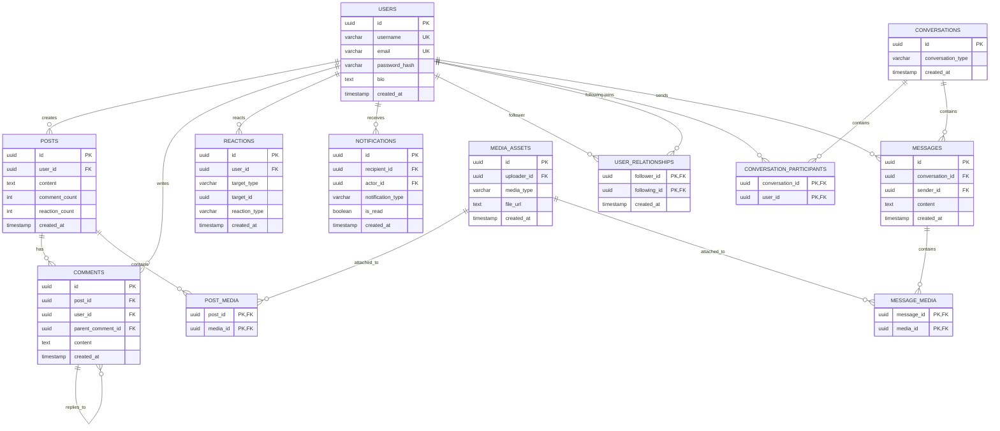

# Social Media Platform Database Design

## Overview

This submission provides a normalized relational database schema for a social media platform supporting:

* User profiles and follower/following relationships
* Posts with multimedia content
* Comments and reactions
* Private messaging
* Activity feeds and notifications

The design prioritizes data integrity, query performance, and scalability.

---

# 1. Normalized Database Schema

The schema follows Third Normal Form (3NF).

### Main Tables

| Table                     | Purpose                          |
| ------------------------- | -------------------------------- |
| users                     | User profiles                    |
| user_relationships        | Follower/following relationships |
| posts                     | User-generated posts             |
| media_assets              | Uploaded images/videos           |
| post_media                | Post-media mapping               |
| comments                  | Post comments and replies        |
| reactions                 | Reactions on posts and comments  |
| conversations             | Chat conversations               |
| conversation_participants | Conversation members             |
| messages                  | Private messages                 |
| notifications             | User notifications               |

### Schema Diagram



---

# 2. Relationships and Constraints

### Users ↔ Users (Followers)

```text
users
    │
    └── user_relationships
            │
            └── users
```

Constraints:

* Composite Primary Key `(follower_id, following_id)`
* Prevent duplicate follow relationships
* Prevent orphaned references through foreign keys

---

### Posts ↔ Media

```text
posts
   │
   └── post_media
          │
          └── media_assets
```

Supports multiple media files per post.

---

### Comments

Comments support nesting through self-referencing relationships.

```text
comments.parent_comment_id
    → comments.id
```

Allows threaded discussions.

---

### Reactions

A polymorphic reaction model is used.

```text
reaction
├── post
└── comment
```

Constraint:

```sql
UNIQUE(user_id, target_type, target_id)
```

Prevents duplicate reactions from the same user.

---

### Messaging

```text
conversations
        │
        ├── participants
        └── messages
```

Supports both direct and group conversations.

---

# 3. Index Design

The following indexes are designed for common access patterns.

### User Lookup

```sql
users(username)
users(email)
```

Used for:

* Login
* Profile lookup

---

### User Posts

```sql
posts(user_id, created_at DESC)
```

Used for:

```sql
SELECT *
FROM posts
WHERE user_id = ?
ORDER BY created_at DESC;
```

---

### Followers

```sql
user_relationships(following_id)
```

Used for:

```sql
SELECT follower_id
FROM user_relationships
WHERE following_id = ?;
```

---

### Comments

```sql
comments(post_id, created_at)
```

Used for comment retrieval.

---

### Messaging

```sql
messages(conversation_id, created_at DESC)
```

Used for chat history retrieval.

---

### Notifications

```sql
notifications(recipient_id, is_read)
```

Used for unread notification queries.

---

# 4. Feed Generation Query

The following query generates a user's timeline from accounts they follow.

```sql
SELECT
    p.id,
    p.user_id,
    p.content,
    p.created_at
FROM posts p
JOIN user_relationships ur
    ON ur.following_id = p.user_id
WHERE ur.follower_id = :user_id
ORDER BY p.created_at DESC
LIMIT 50;
```

This query benefits from:

```sql
user_relationships(follower_id, following_id)
posts(user_id, created_at)
```

indexes.

---

# 5. Caching Strategy

Redis is proposed as the primary caching layer.

### Feed Cache

```text
feed:user:{user_id}
```

Stores recent post IDs for timeline generation.

Benefit:

* Reduces expensive feed joins
* Improves feed response times

---

### User Cache

```text
user:{user_id}
```

Stores profile information.

---

### Post Cache

```text
post:{post_id}
```

Stores frequently accessed posts.

---

### Notification Counter

```text
notif:{user_id}:unread
```

Provides O(1) unread notification counts.

---

# Performance and Scalability Considerations

### Performance Optimization

* Composite indexes on high-frequency queries
* Redis caching for read-heavy workloads
* Counter denormalization for reaction and comment counts

### Scalability

* Feed caching reduces database load
* Messaging and notifications can be moved to separate services
* Read replicas can be introduced for scaling reads
* Feed generation can evolve to fan-out-on-write architecture

### Data Integrity

* Foreign key constraints
* Composite primary keys
* Unique constraints
* Normalized schema (3NF)

### Query Efficiency

* Indexed feed generation query
* Indexed messaging queries
* Indexed notification lookups
* Cached hot data using Redis
