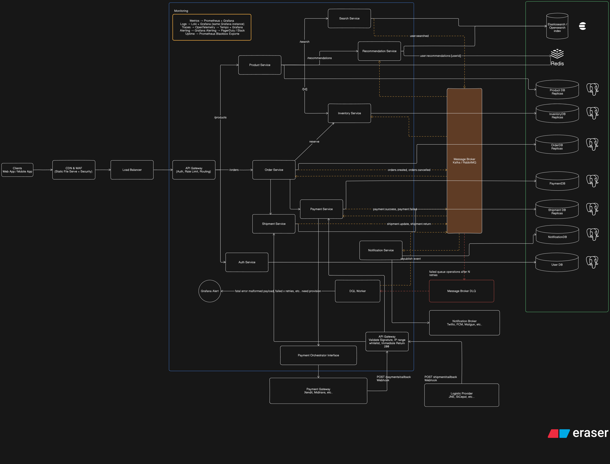
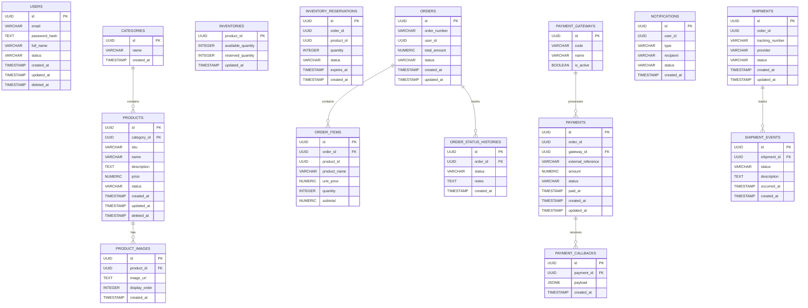

# System Design & Architecture

## 1. High-level Architecture Diagram



## 2. Database schema design



## 3. Technology stack recommendations

### Language & Framework

| Service                | Language              | Framework     | Reason                                          |
| ---------------------- | --------------------- | ------------- | ----------------------------------------------- |
| All microservices      | **Go (Golang)** | **Gin** | Fast startup, low memory, excellent concurrency |
| Admin / Internal tools | **Go**          | **Gin** | Consistency across the codebase                 |

> **Why Go?** Low memory footprint, fast cold starts, single binary deploy, built-in concurrency via goroutines � ideal for microservices under load.

---

### Communication

| Type                         | Technology                 | Used For                                                        |
| ---------------------------- | -------------------------- | --------------------------------------------------------------- |
| External (client to service) | **REST / HTTP JSON** | All public-facing APIs via API Gateway                          |
| Internal sync                | **gRPC**             | Order to Inventory (stock reservation), latency-sensitive paths |
| Internal async               | **Apache Kafka**     | payment.success, order.created, shipment.update, etc.           |

> **Why Kafka?** Disk-backed retention, message replay, high throughput. Critical for payment/order events where auditability matters.

---

### API Gateway

| Gateway                                                   | Role                                                                  |
| --------------------------------------------------------- | --------------------------------------------------------------------- |
| **Kong** (self-hosted) or **AWS API Gateway** | Main gateway � JWT auth, rate limiting, routing                      |
| **Nginx**                                           | Webhook ingress � IP whitelist, signature passthrough, immediate 200 |

---

### Databases

| Service            | Database             | Notes                                                 |
| ------------------ | -------------------- | ----------------------------------------------------- |
| User, Auth         | **PostgreSQL** | Shared instance, separate schemas                     |
| Product, Inventory | **PostgreSQL** | Shared instance, separate schemas                     |
| Order              | **PostgreSQL** | Separate instance � high write volume                |
| Payment            | **PostgreSQL** | Separate instance � financial data, strict isolation |
| Shipment           | **PostgreSQL** | Separate instance                                     |
| Notification       | **PostgreSQL** | Shared instance, separate schema                      |

> All PostgreSQL � ACID-compliant, great UUID and JSONB support, simple to operate.

---

### Caching

| Technology      | Used For                                                  |
| --------------- | --------------------------------------------------------- |
| **Redis** | Recommendation cache, session tokens, rate limit counters |

---

### Search

| Technology           | Used For                                  |
| -------------------- | ----------------------------------------- |
| **OpenSearch** | Full-text product search, filters, facets |

> Prefer OpenSearch over Elasticsearch to avoid licensing restrictions. Fully API-compatible.

---

### Containerization & Orchestration

| Technology                 | Role                                                     |
| -------------------------- | -------------------------------------------------------- |
| **Docker**           | Containerize all services                                |
| **Kubernetes (K8s)** | Orchestration � scaling, rolling deploys, health checks |
| **Helm**             | K8s package management per service                       |

---

### Infrastructure / Cloud

| Component          | Recommendation                                             |
| ------------------ | ---------------------------------------------------------- |
| Cloud Provider     | **AWS** (or GCP)                                     |
| Managed K8s        | **EKS** (AWS) or **GKE** (GCP)                 |
| Managed Kafka      | **AWS MSK** or **Confluent Cloud**             |
| Managed Redis      | **AWS ElastiCache**                                  |
| Managed PostgreSQL | **AWS RDS** / **Aurora PostgreSQL**            |
| Managed Search     | **AWS OpenSearch Service**                           |
| Object Storage     | **AWS S3** � product images, static assets          |
| CDN                | **AWS CloudFront**                                   |
| Secret Management  | **HashiCorp Vault** or **AWS Secrets Manager** |

---

### Service Mesh (Optional)

| Technology                           | Role                                                   |
| ------------------------------------ | ------------------------------------------------------ |
| **Istio** or **Linkerd** | mTLS between services, traffic policies, observability |

> Start without. Add when you need zero-trust networking at scale.

---

### CI / CD

| Technology                               | Role                                 |
| ---------------------------------------- | ------------------------------------ |
| **GitHub Actions**                 | CI � lint, test, build Docker image |
| **ArgoCD**                         | CD � GitOps deployment to K8s       |
| **AWS ECR** / **Docker Hub** | Container registry                   |

---

### Monitoring

| Pillar   | Technology                                                          |
| -------- | ------------------------------------------------------------------- |
| Metrics  | **Prometheus** + **Grafana**                            |
| Logs     | **Loki** + **Grafana** (same instance)                  |
| Traces   | **OpenTelemetry** to **Tempo** + **Grafana**      |
| Alerting | **Grafana Alerting** to **PagerDuty** / **Slack** |
| Uptime   | **Prometheus Blackbox Exporter**                              |

---

### Notification Delivery

| Channel           | Provider                               |
| ----------------- | -------------------------------------- |
| Push notification | **Firebase FCM**                 |
| SMS               | **Twilio**                       |
| Email             | **Mailgun** or **AWS SES** |

---

### Security

| Concern                | Solution                                                   |
| ---------------------- | ---------------------------------------------------------- |
| Authentication         | **JWT** (short-lived access token)                   |
| Webhook verification   | **HMAC-SHA256** signature per provider               |
| Secret storage         | **HashiCorp Vault** or **AWS Secrets Manager** |
| Transport              | **TLS everywhere** � external and internal          |
| DB credential rotation | Vault dynamic secrets                                      |

## 4. API specification outline

### User Service

#### Register User

| Field    | Value                     |
| -------- | ------------------------- |
| Method   | POST                      |
| Endpoint | `/api/v1/auth/register` |

##### Headers

```http
Content-Type: application/json
```

##### Request

```json
{
  "email": "user@example.com",
  "password": "password123",
  "full_name": "John Doe"
}
```

##### Response

```json
{
  "id": "uuid",
  "email": "user@example.com",
  "full_name": "John Doe"
}
```

#### Login

| Field    | Value                  |
| -------- | ---------------------- |
| Method   | POST                   |
| Endpoint | `/api/v1/auth/login` |

##### Headers

```http
Content-Type: application/json
```

##### Request

```json
{
  "email": "user@example.com",
  "password": "password123"
}
```

##### Response

```json
{
  "access_token": "jwt-token"
}
```

### Product Service

#### List Products

| Field    | Value                |
| -------- | -------------------- |
| Method   | GET                  |
| Endpoint | `/api/v1/products` |

##### Query Parameters

| Name        | Type    |
| ----------- | ------- |
| page        | integer |
| limit       | integer |
| category_id | uuid    |
| keyword     | string  |

##### Response

```json
{
  "data": [
    {
      "id": "uuid",
      "name": "iPhone 15",
      "price": 1200
    }
  ],
  "page": 1,
  "total": 100
}
```

#### Get Product Detail

| Field    | Value                             |
| -------- | --------------------------------- |
| Method   | GET                               |
| Endpoint | `/api/v1/products/{product_id}` |

##### Response

> Inventory data (`available_quantity`, `reserved_quantity`) is fetched internally from the Inventory Service and merged into the response. Consumers do not need a separate call.

```json
{
  "id": "uuid",
  "name": "iPhone 15",
  "description": "...",
  "price": 1200,
  "images": [],
  "available_quantity": 100,
  "reserved_quantity": 10
}
```

#### Search Products

| Field    | Value                       |
| -------- | --------------------------- |
| Method   | GET                         |
| Endpoint | `/api/v1/products/search` |

##### Query Parameters

| Name        | Type    |
| ----------- | ------- |
| keyword     | string  |
| category_id | uuid    |
| min_price   | decimal |
| max_price   | decimal |
| page        | integer |
| limit       | integer |

##### Response

```json
{
  "data": [
    {
      "id": "uuid",
      "name": "iPhone 15"
    }
  ]
}
```

#### Get Product Recommendations

| Field    | Value                               |
| -------- | ----------------------------------- |
| Method   | GET                                 |
| Endpoint | `/api/v1/products/recommendation` |

##### Headers

```http
Authorization: Bearer <token>
```

##### Response

```json
{
  "products": [
    {
      "id": "uuid",
      "name": "iPhone 15"
    }
  ]
}
```

### Inventory Service

> **Note:** `GET /inventories/{product_id}` is an **internal endpoint** only — inventory data is surfaced to consumers via `GET /products/{product_id}`. Stock reservation is triggered internally when an order is created. The `expires_at` maps to the payment window of the chosen gateway (e.g. 15 min for QRIS, 1 hour for e-wallet, 24 hours for bank transfer). Reservation is confirmed on successful payment callback, or released automatically on expiry.

### Order Service

#### Create Order

| Field    | Value              |
| -------- | ------------------ |
| Method   | POST               |
| Endpoint | `/api/v1/orders` |

> Atomically creates an order, reserves stock, and initiates payment with the chosen gateway in a single request. The user must commit to a payment method upfront to prevent stock hoarding.

##### Headers

```http
Authorization: Bearer <token>
Content-Type: application/json
```

##### Request

```json
{
  "items": [
    {
      "product_id": "uuid",
      "quantity": 2
    }
  ],
  "gateway_code": "midtrans"
}
```

##### Response

```json
{
  "id": "uuid",
  "order_number": "ORD-20260618-001",
  "status": "pending_payment",
  "total_amount": 2400,
  "payment_url": "https://payment-provider.com/pay",
  "payment_expires_at": "2026-06-19T04:03:00Z"
}
```

#### Get Order Detail

| Field    | Value                         |
| -------- | ----------------------------- |
| Method   | GET                           |
| Endpoint | `/api/v1/orders/{order_id}` |

##### Headers

```http
Authorization: Bearer <token>
```

##### Response

```json
{
  "id": "uuid",
  "status": "paid",
  "total_amount": 2400,
  "items": []
}
```

#### Track Order

| Field    | Value                                  |
| -------- | -------------------------------------- |
| Method   | GET                                    |
| Endpoint | `/api/v1/orders/{order_id}/tracking` |

##### Response

```json
{
  "current_status": "processing",
  "history": [
    {
      "status": "pending_payment",
      "created_at": "..."
    },
    {
      "status": "paid",
      "created_at": "..."
    }
  ]
}
```

### Payment Service

#### List Payment Gateways

| Field    | Value                        |
| -------- | ---------------------------- |
| Method   | GET                          |
| Endpoint | `/api/v1/payment-gateways` |

##### Response

```json
{
  "data": [
    {
      "code": "midtrans",
      "name": "Midtrans"
    },
    {
      "code": "xendit",
      "name": "Xendit"
    }
  ]
}
```

#### Payment Callback

| Field    | Value                         |
| -------- | ----------------------------- |
| Method   | POST                          |
| Endpoint | `/api/v1/payments/callback` |

##### Headers

```http
X-Signature: xxx
Content-Type: application/json
```

##### Request

```json
{
  "transaction_id": "abc",
  "status": "paid"
}
```

##### Response

```json
{
  "message": "success"
}
```

## 5. Scalability and reliability considerations

### 5.1 Horizontal Scaling

All services are stateless and containerized. Kubernetes Horizontal Pod Autoscaler (HPA) handles automatic scale-out based on CPU and memory thresholds.

| Service              | Scaling Trigger    | Notes                                     |
| -------------------- | ------------------ | ----------------------------------------- |
| Product Service      | CPU > 70%          | Stateless — scale freely                 |
| Search Service       | Request rate       | ES query-heavy, scale with ES cluster     |
| Order Service        | CPU / RPS          | Scale independently from Payment          |
| Payment Service      | CPU > 70%          | Stateless — callback processing is async |
| Shipment Service     | Kafka consumer lag | Scale when lag accumulates                |
| Notification Service | Kafka consumer lag | Scale when lag accumulates                |
| DLQ Worker           | DLQ queue depth    | Scale when DLQ fills up                   |

---

### 5.2 Database Scaling

#### Read Replicas

All PostgreSQL instances run with at least one read replica. Read-heavy queries (product listing, order history, tracking) are routed to replicas. Writes always target the primary.

```
Primary DB   ← writes (INSERT order, UPDATE status)
Read Replica ← reads  (GET /orders, GET /products)
```

#### Connection Pooling

Use **PgBouncer** in front of each PostgreSQL instance to prevent connection exhaustion under high load. Services connect to PgBouncer, not directly to Postgres.

#### Sharding (Future)

If a single table grows beyond manageable size (e.g., `orders`, `order_status_histories`), partition by `created_at` (range) or `user_id` (hash).

---

### 5.3 Caching Strategy

| Layer            | What is Cached                    | TTL          | Invalidation                          |
| ---------------- | --------------------------------- | ------------ | ------------------------------------- |
| Redis            | `user:recommendations:{userId}` | 1 hour       | Recomputed on `user.searched` event |
| CDN (CloudFront) | Product images, static assets     | 24 hours     | Versioned URLs (cache busting)        |

---

### 5.4 Kafka Partitioning & Consumer Scaling

| Topic                       | Partitions | Consumer Groups                                        |
| --------------------------- | ---------- | ------------------------------------------------------ |
| `payment.success`         | 10         | order-service, inventory-service, notification-service |
| `payment.failed`          | 10         | order-service, inventory-service, notification-service |
| `order.created`           | 10         | inventory-service, notification-service                |
| `shipment.status_updated` | 5          | notification-service                                   |
| `user.searched`           | 5          | recommendation-service                                 |

> Number of consumers per group cannot exceed partition count. Scale consumers up to the partition limit before adding more partitions.

---

### 5.5 Idempotency

Duplicate events and duplicate webhook deliveries are guaranteed to happen. Every consumer must be idempotent.

#### Payment Callbacks

Use `external_reference` from the gateway as a deduplication key:

```sql
INSERT INTO payments (external_reference, ...)
ON CONFLICT (external_reference) DO NOTHING;
```

#### Kafka Consumers

Consumers track offsets. On restart they re-read from the last committed offset. Handlers must be safe to run twice:

```
if order.status == 'paid' → skip, already processed
```

#### Shipment Callbacks

Deduplicate by `tracking_number + status + occurred_at` before inserting into `shipment_events`.

---

### 5.6 Stock Reservation Concurrency

Use `SELECT FOR UPDATE` to prevent overselling when multiple users reserve the same product simultaneously:

```sql
BEGIN;
  SELECT available_quantity FROM inventories
  WHERE product_id = $1 FOR UPDATE;

  UPDATE inventories
  SET available_quantity = available_quantity - $qty,
      reserved_quantity  = reserved_quantity  + $qty
  WHERE product_id = $1
    AND available_quantity >= $qty;

  INSERT INTO inventory_reservations (...);
COMMIT;
```

If `available_quantity < requested_qty`, rollback and return `409 Conflict`.

---

### 5.7 Circuit Breaker

Synchronous service-to-service calls (Order Service → Inventory Service) use a circuit breaker to prevent cascading failures.

| State               | Behavior                                                      |
| ------------------- | ------------------------------------------------------------- |
| **Closed**    | Normal — requests pass through                               |
| **Open**      | Inventory down — fail fast, return error immediately         |
| **Half-Open** | Probe with one request — close on success, reopen on failure |

If the circuit is open during order creation:

```json
{
  "error": "Service temporarily unavailable. Please try again shortly."
}
```

---

### 5.8 Rate Limiting

Applied at the API Gateway (NGINX) level:

| Endpoint                     | Limit            | Window                      |
| ---------------------------- | ---------------- | --------------------------- |
| `POST /auth/login`         | 10 requests      | 1 min per IP                |
| `POST /auth/register`      | 5 requests       | 1 min per IP                |
| `POST /orders`             | 20 requests      | 1 min per user              |
| `GET /products/search`     | 100 requests     | 1 min per user              |
| `POST /payments/callback`  | Not rate-limited | Webhook ingress is separate |
| `POST /shipments/callback` | Not rate-limited | Webhook ingress is separate |

---

### 5.9 Health Checks & Graceful Shutdown

Every service exposes:

```
GET /health/live  → 200 if process is alive (Kubernetes liveness probe)
GET /health/ready → 200 if DB and dependencies are reachable (readiness probe)
```

On `SIGTERM` (Kubernetes rolling deploy):

1. Stop accepting new requests
2. Finish in-flight requests — drain window max 30s
3. Close DB connections and Kafka consumers
4. Exit cleanly

This ensures zero dropped requests during rolling deploys.

---

### 5.10 Eventual Consistency

Async event-driven communication means some data is temporarily inconsistent. This is acceptable for:

| Scenario                              | Acceptable Lag     |
| ------------------------------------- | ------------------ |
| Order status update after payment     | < 1 second (Kafka) |
| Recommendation cache refresh          | < 5 minutes        |
| Notification delivery                 | < 5 seconds        |
| Shipment status reflected in tracking | < 10 seconds       |

It is **not** acceptable for:

- Stock reservation — synchronous, must be immediately consistent
- Payment record creation — synchronous, within the same DB transaction
